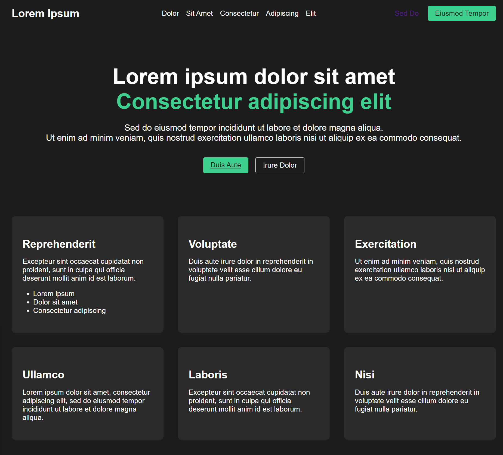

# Clone A Web Page Layout With Claude and Aider

If you need a landing page but you don't have any good ideas, find an existing website that you like and ~~steal~~ clone its layout. Of course, you could just download the files and hack them yourself, but there will be a lot of stuff in there you don't want. Instead, use an AI tool to copy its layout and use that.

This is a very simple project, but it did one thing I didn't expect that was impressive. See the results below.

In this demo, I'm going to use the following:

- [Aider](https://aider.chat/) for the AI Code Gen Front End.
  - I like Aider because it runs in a separate terminal so it doesn't take up space in VSCode. And its easier to restart if I need to without disturbing the editor. And also, because it works great. 
  - You could do all this with any of the decent code gen front end, like [Claude-Dev](https://github.com/saoudrizwan/claude-dev) or [Zed-AI](https://zed.dev/blog/zed-ai). 
- [Anthropic Claude-3.5-sonnet](https://www.anthropic.com/news/claude-3-5-sonnet?ref=hjortur.blog) as the AI LLM. 
- Code Editor/IDE
  - This process **DOES NOT REQUIRE EDITING ANY CODE YOURSELF**. But its nice to be able to look at the code.
  - you can use any editor. in this demo I don't rely on extensions or built in app features. 
  - I used VSCode for this project. Zed is good too.

**You should get similar results if you generate the code with other tools, but following the same prompts. The important things are the prompts, which are shown below**

## Get Ready

- Setup a Python Environment 
  - Aider uses Python
  - I use MiniConda but you can use any Python setup with or without a virtual environment. You just need a recent Python 3.

- Install Aider
  - https://aider.chat/
  - https://www.youtube.com/watch?v=XNFj7uBb7PE
  - https://www.youtube.com/watch?v=Y-_0VkMUiPc
  - Connect an LLM
    - Aider supports most LLM
    - https://aider.chat/docs/llms.html

## Start Coding

Create a working directory and cd into it.

### Pick A Web Page You LIke 

I'm going to use the landing page from [Supabase](https://supabase.com/), because I use Supabase, and it looks good and modern for a dev product.

- open the web page
- take a screen shot or snip it
- crop out extraneous things like the browser toolbar etc
- save it in the working directory. I named it supabase.png

### Copy The Layout With Aider/Claude

- Start Aider
  - it will print out its configuration info. Check that it looks ok. 
  - it will want to setup a git repo. Say yes to that, it allows undo of commits.
  - when you give Aider prompts, you get a lot of feedback of what it is doing. I left that out and just show you the prompts. I included the entire history in chat-history.md if you are interested.
  - now you can give it prompts

- Add the web page image to the context

**--Prompt--**
```text
/add supabase.png
```
- Clone the layout with a prompt like this
  - notice that we are not web scraping supabase.com. We are only using a screenshot.

**--Prompt--**
```text
create a landing page for a website. duplicate the layout of supabase.png. use html, css and javascript as necessary. name the output files index.html,style.css and script.js.
```
  - it should generate the 3 files
- Ask it create a simple static web server to test the web page

**--Prompt--**
```text
create a simple static web server using python so I can test the results
```
You will get a short python file. Aider might ask if you want to run it. Say yes or run it in a separate terminal. If you way yes it will 

 ### Now See The Magic

 - Open a browser to where the python server is running.
 - In my case it almost duplicated the layout exactly.  It didn't try to copy some of the graphics. **Most important it figured out some of the anchor links and buttons that were on the original web page. I was 'WOW' the first time I did this.**

### Update The Page

Of course we don't actually want to duplicate supabase itself (that would be unethical, illegal, or at least it would be a lot of work), just the layout, so give it a couple of more prompts.

- Change the original text to placeholders

**--Prompt--**
```text
substitute the original text in index.html with lorum ipsum text
```

- It actually duplicated the anchor links but in my case it pointed them back at this same page. You can see which ones it found by looking in the generated source or by hovering over them. Just to test, ask Aider to point all the anchor tags to point to something else.

*If it asks to add the URL to the chat, say **NO** because it will think you want to scrape that page. We dont want to do that.*

**--Prompt--**
```text
in index.html, modify all anchor tabs to point to https://news.ycombinator.com/
```
- refresh the page and test the links

### The End Result

Of course your results may differ because different models may do something different. Even the same one may do something different if you repeat the process clean.

Maybe the most import thing it generated was a valid style.css file that you could use on any project to get a similar vibe.

The code here includes the python server so you can run it as is. Here's a screenshot of the final project.


  
### Cost

This exercise cost me $0.15 using Anthropic. 
